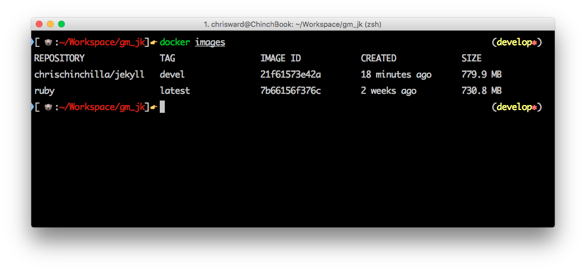
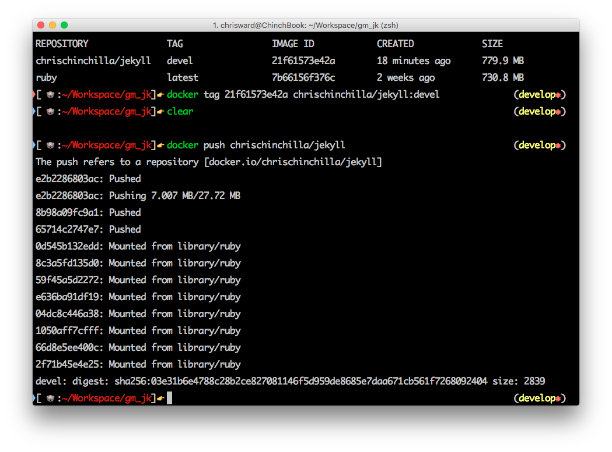
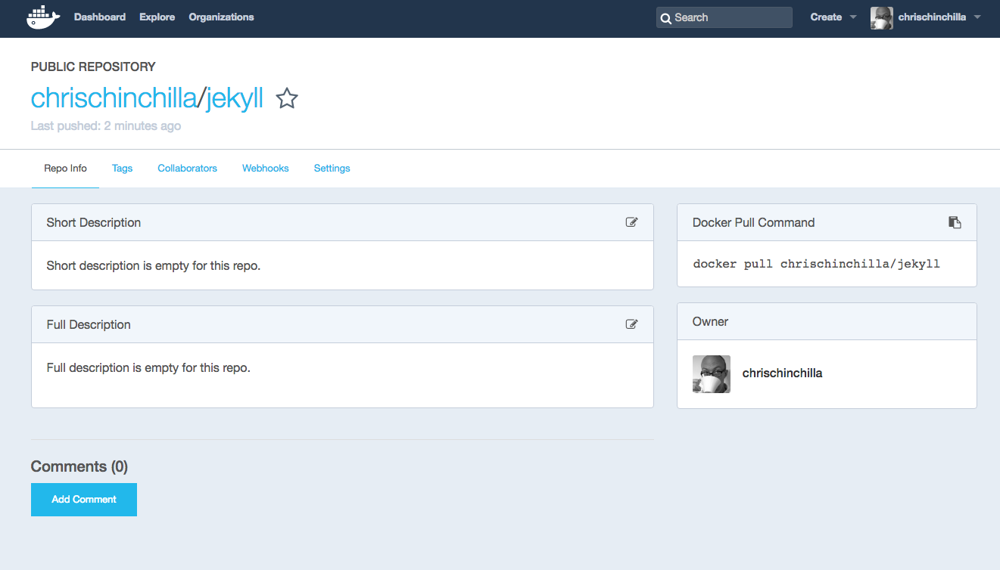

# A Beginners Guide Guide to the Humble Dockerfile

The humble but powerful _Dockerfile_ is the building block of Docker images and containers. In essence, it's a list of commands the Docker engine runs to assemble the image, and thus instances of images as containers.

Let's look at an example before learning to construct our own.

This is the _[Dockerfile](<https://hub.docker.com/>>_/rethinkdb/)_ for [RethinkDB](https://www.rethinkdb.com/), a popular open source real-time database.

```dockerfile
FROM debian:jessie

MAINTAINER Daniel Alan Miller <dalanmiller@rethinkdb.com>

RUN apt-key adv --keyserver pgp.mit.edu --recv-keys 1614552E5765227AEC39EFCFA7E00EF33A8F2399
RUN echo "deb http://download.rethinkdb.com/apt jessie main" > /etc/apt/sources.list.d/rethinkdb.list

ENV RETHINKDB_PACKAGE_VERSION 2.0.4~0jessie

RUN apt-get update \
    && apt-get install -y rethinkdb=$RETHINKDB_PACKAGE_VERSION \
    && rm -rf /var/lib/apt/lists/*

VOLUME ["/data"]

WORKDIR /data

CMD ["rethinkdb", "--bind", "all"]

EXPOSE 28015 29015 8080
```

The first `FROM` command is an important Docker command, allowing you to pull dependencies from other images, in this case the Jessie version of [Debian](https://hub.docker.com/_/debian/). The next command sets the maintainer of the image, for reference and information.

The `RUN` command is something you will use frequently, these define commands to run from within the container when it's first created. These can be any command line instruction you wish if you have the dependency to support it. For example, if you are using an image that contains a ruby run-time, these could be ruby commands.

`ENV` sets an environment variable available within the container, useful for setting variables that software needs to run.

`VOLUME` defines a path in the container that Docker exposes to the host system and mapped using the `-v` argument when running a container.

`WORKDIR` changes the active directory of the container to a specified location, in case you need to run commands from or in a particular location.

Whilst `RUN` issues commands used to prepare the container for use, `CMD` runs the software that the container is designed to run (in the format `CMD ["executable", "parameter1", "parameter2"]`), and is best used for commands that result in an interactive shell, such as `python`. Reflecting Docker's microservice structure, there should ideally only ever be one `CMD`, and if there is more than one, only the last will matter. If your container needs something more complex, then use the `ENTRYPOINT` command. Used in conjunction with `CMD` for parameters, `ENTRYPOINT` sets the main command for the image, allowing you to run an image as if it were that command.

For example, the below runs the `swarm` command, passing `--help` as a parameter:

```dockerfile
ENTRYPOINT ["/swarm"]
CMD ["--help"]
```

Another common use of the `ENTRYPOINT` command is to run a bash script in the image, allowing for more complex operations.

`EXPOSE` exposes the ports that the software uses, ready for you to map to the host when running a container with the `-p` argument.

## Create a Dockerfile from Scratch

For this example, I am going to create an image (and thus container) for testing the website and build process for a site built in [Jekyll](https://jekyllrb.com/). I'm picking Jekyll because all my sites use Jekyll, it's a simple system to understand, and well, I love it.

**Note**: There is an [official image](https://hub.docker.com/r/jekyll/jekyll/), but it doesn't use the latest version of Jekyll, is (in my opinion) over complicated, and anyway, I want to show you how to write your own 😁.

Create a new folder, and then a _Dockerfile_ inside it.

Start by setting the base image, which in this case will be [the official Ruby image](https://hub.docker.com/_/ruby/), and set a maintainer.

```dockerfile
FROM ruby:latest
MAINTAINER Name <info@example.com>
```

Now create a user and group for Jekyll, set appropriate permissions and install the Jekyll gem:

```dockerfile
RUN \
  mkdir -p /home/jekyll && \
  groupadd -rg 1000 jekyll &&  \
  useradd  -rg jekyll -u 1000 -d /home/jekyll jekyll && \
  chown jekyll:jekyll /home/jekyll && \
  gem install jekyll
```

I am working on the source files for the project locally, so create a mount point where the Docker container can access files on the host system.

```dockerfile
VOLUME /home/jekyll
```

You can also copy the files into the container, but this makes the image less flexible:

```dockerfile
COPY . /home/jekyll/
```

There are a folders you don't need in the container, so create a new _.dockerignore_ file to ignore certain paths:

```dockerfile
.bundle
.git
_site
```

Next, set the directory that contains the site, and serve the site.

```dockerfile
WORKDIR /home/jekyll
ENTRYPOINT ["jekyll", "serve"]
EXPOSE 4000
```

You can now build the image with:

```dockerfile
docker build .
```

Create a container based on the image with any variation of the `docker run` command you wish, but something like the command below will create a container based on the image that sets a name, and mounts a local volume at the mount point. You can get the `IMAGE_ID` from the `docker images` command:

```bash
docker run --name cs_jk -it -d -P -v <PATH_TO_SITE>:/home/jekyll  <IMAGE_ID>
```

So far, so good, but as the Jekyll site grows, you will add gems and other dependencies that also need to be available in the container, let's fix that by adding these lines below the `WORKDIR` command:

```dockerfile
COPY Gemfile /home/jekyll
COPY Gemfile.lock /home/jekyll
RUN bundle install
```

Now when you rebuild and rerun the container, the Gems added will be available.

## Push Image to Docker Hub

Great! You now have a simple custom image, the next step is to get it onto the Docker Hub, where it can be more useful to you and other Docker users.

Create an account on the [Docker Hub](http://docs.docker.com) and then login from your terminal with the same credentials:

```bash
docker login
```

Now, tag your image:

```bash
docker tag <IMAGE_ID> <USERNAME>/jekyll:devel
```

Of course, feel free to change all the values to something else, they can be anything that works for you, but there are some standard tags that users expect. Now if you run `docker images` you finally see a user-readable name in the `REPOSITORY` column.



And push it to the Docker hub:

```bash
docker push <USERNAME>/jekyll
```



If you login in to your Hub account you will see the image listed and ready for others to use with a `docker pull <USERNAME>/jekyll` command.



## Next Steps and Best Practices

A Dockerfile is simple, and this is intentional. One of the core concepts of Docker is for each component to be as small and discrete as possible, with each container ideally performing one task each.

Take a Jekyll site for example, maybe you also want to lint your code and text for errors, then create another image and container. Want to generate an ePub of your text, create another container with a Pandoc process. Need Search on your site? Hook up an Elasticsearch image and container. You can then link these together and share the same code base with [Docker Compose](https://docs.docker.com/compose/), allowing you to create complex inter-connected containers and applications.

_Dockerfile_s are the building blocks of Docker and nothing else in the toolchain works without them, whilst they are simple, in practise it can be complex to understand the best way to write them to provide maximum flexibility. If you want to read more, then I recommend [Docker's official guide](https://docs.docker.com/engine/userguide/eng-image/dockerfile_best-practices/) and I welcome any of your comments or questions.
